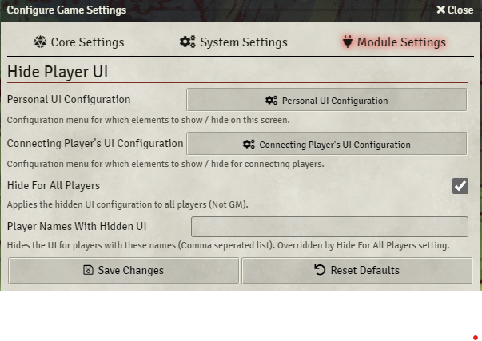
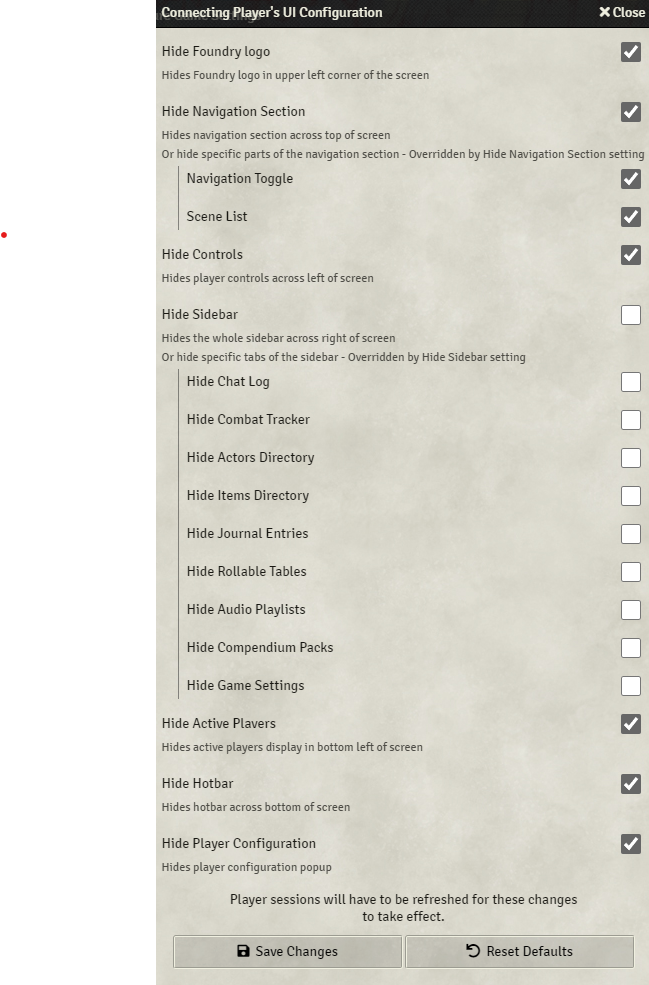

# hide-player-ui

A simple module for [FoundryVtt](https://foundryvtt.com/) that enables users to configure what Foundry UI they would like to have shown on the screen. The GM can also override what UI connecting players are allowed to see. One common use case for this is when a screen is being used to just broadcast the map and much of the onscreen UI is not needed.

